## Part 1. Генератор файлов
**== Задание ==**

Написать bash-скрипт. Скрипт запускается с 6 параметрами. Пример запуска скрипта: \
`main.sh /opt/test 4 az 5 az.az 3kb` 

**Параметр 1** - это абсолютный путь. \
**Параметр 2** - количество вложенных папок. \
**Параметр 3** - список букв английского алфавита, используемый в названии папок (не более 7 знаков). \
**Параметр 4** - количество файлов в каждой созданной папке. \
**Параметр 5** - список букв английского алфавита, используемый в имени файла и расширении (не более 7 знаков для имени, не более 3 знаков для расширения). \
**Параметр 6** - размер файлов (в килобайтах, но не более 100).  

Имена папок и файлов должны состоять только из букв, указанных в параметрах, и использовать каждую из них хотя бы 1 раз.  
Длина этой части имени должна быть от 4 знаков, плюс дата запуска скрипта в формате DD.MM.YY, отделённая нижним подчёркиванием, например: \
**./aaaz_021121/**, **./aaazzzz_021121** 

При этом, если для имени папок или файлов были заданы символы `az`, то в названии файлов или папок не может быть обратной записи: \
**./zaaa_021121/**, т.е. порядок указанных символов в параметре должен сохраняться.

При запуске скрипта в указанном в параметре 1 месте, должны быть созданы папки и файлы в них с соответствующими именами и размером.  
Скрипт должен остановить работу, если в файловой системе (в разделе /) останется 1 Гб свободного места.  
Записать лог файл с данными по всем созданным папкам и файлам (полный путь, дата создания, размер для файлов).

# Результат выполнения задания ⬇︎
#### 
#### 
#### 
## Part 2. Засорение файловой системы

А теперь пришло время показать Майку на что способен человек, которого лишили сэндвича.

**== Задание ==**

Написать bash-скрипт. Скрипт запускается с 3 параметрами. Пример запуска скрипта: \
`main.sh az az.az 3Mb`

**Параметр 1** - список букв английского алфавита, используемый в названии папок (не более 7 знаков). \
**Параметр 2** - список букв английского алфавита, используемый в имени файла и расширении (не более 7 знаков для имени, не более 3 знаков для расширения). \
**Параметр 3** - размер файла (в Мегабайтах, но не более 100).  

Имена папок и файлов должны состоять только из букв, указанных в параметрах, и использовать каждую из них хотя бы 1 раз.  
Длина этой части имени должна быть от 5 знаков, плюс дата запуска скрипта в формате DD.MM.YY, отделённая нижним подчёркиванием, например: \
**./aaaz_021121/**, **./aaazzzz_021121** 

При этом, если для имени папок или файлов были заданы символы `az`, то в названии файлов или папок не может быть обратной записи: \
**./zaaa_021121/**, т.е. порядок указанных в параметре символов должен сохраняться.

При запуске скрипта, в различных (любых, кроме путей содержащих **bin** или **sbin**) местах файловой системы, должны быть созданы папки с файлами.
Количество вложенных папок - до 100. Количество файлов в каждой папке - случайное число (для каждой папки своё).  
Скрипт должен остановить работу, когда в файловой системе (в разделе /) останется 1 Гб свободного места.  
Свободное место в файловой системе определять командой: `df -h /`  

Записать лог файл с данными по всем созданным папкам и файлам (полный путь, дата создания, размер для файлов).  
В конце работы скрипта, вывести на экран время начало работы скрипта, время окончания и общее время его работы. Дополнить этими данными лог файл.

# Результат выполнения задания ⬇︎
#### 
## Part 3. Очистка файловой системы

Проклятье! Вы запустили скрипт не на том компьютере. Теперь вам срочно нужно написать скрипт, который всё исправит.

**== Задание ==**

Написать bash-скрипт. Скрипт запускается с 1 параметром.
Скрипт должен уметь очистить систему от созданных в [Part 2](#part-2-засорение-файловой-системы) папок и файлов 3 способами:

1. По лог файлу
2. По дате и времени создания
3. По маске имени (т.е. символы, нижнее подчёркивание и дата).  

Способ очистки задается при запуске скрипта, как параметр со значением 1, 2 или 3.

*При удалении по дате и времени создания, пользователем вводятся времена начала и конца с точностью до минуты. Удаляются все файлы, созданные в указанном временном промежутке. Ввод может быть реализован как через параметры, так и во время выполнения программы.*

# Результат выполнения задания ⬇︎
#### 
## Part 4. Генератор логов

Вы наконец закончили со своими делами и готовы продолжать разбираться с мониторингом.

Для начала было бы неплохо создать логи, которые можно будет анализировать.

**== Задание ==**

Написать bash-скрипт или программу на Си, генерирующий 5 файлов логов **nginx** в *combined* формате.
Каждый лог должен содержать информацию за 1 день.

За день должно быть сгенерировано случайное число записей от 100 до 1000.
Для каждой записи должны случайным образом генерироваться:

1. IP (любые корректные, т.е. не должно быть ip вида 999.111.777.777)
2. Коды ответа (200, 201, 400, 401, 403, 404, 500, 501, 502, 503)
3. Методы (GET, POST, PUT, PATCH, DELETE)
4. Даты (в рамках заданного дня лога, должны идти по увеличению)
5. URL запроса агента
6. Агенты (Mozilla, Google Chrome, Opera, Safari, Internet Explorer, Microsoft Edge, Crawler and bot, Library and net tool)

В комментариях в вашем скрипте/программе указать, что означает каждый из использованных кодов ответа.

# Результат выполнения задания ⬇︎
#### 

## Part 5. Мониторинг

Теперь, когда у вас есть файлы для анализа, вы можете приступить к непосредственно мониторингу.

**== Задание ==**

Написать bash-скрипт для разбора логов **nginx** из [Части 4](#part-4-генератор-логов) через **awk**.

Скрипт запускается с 1 параметром, который принимает значение 1, 2, 3 или 4.
В зависимости от значения параметра вывести:

1. Все записи, отсортированные по коду ответа
2. Все уникальные IP, встречающиеся в записях
3. Все запросы с ошибками (код ответа - 4хх или 5хх)
4. Все уникальные IP, которые встречаются среди ошибочных запросов

# Результат выполнения задания ⬇︎
#### 
#### 
## Part 6. **GoAccess**

Смотреть на результаты ваших трудов в консоли конечно неплохо, но почему бы дополнительно не воспользоваться готовым решением, предоставляющим удобный интерфейс?

**== Задание ==**

С помощью утилиты GoAccess получить ту же информацию, что и в [Части 5](#part-5-мониторинг)

Открыть веб интерфейс утилиты на локальной машине.

## Part 7. **Prometheus** и **Grafana**

Практика с логами пока что окончена. Теперь пришло время мониторить состояние системы в целом.

**== Задание ==**

##### Установить и настроить **Prometheus** и **Grafana** на виртуальную машину
##### Получить доступ к веб интерфейсам **Prometheus** и **Grafana** с локальной машины

##### Добавить на дашборд **Grafana** отображение ЦПУ, доступной оперативной памяти, свободное место и кол-во операций ввода/вывода на жестком диске

##### Запустить ваш bash-скрипт из [Части 2](#part-2-засорение-файловой-системы)
##### Посмотреть на нагрузку жесткого диска (место на диске и операции чтения/записи)

##### Установить утилиту **stress** и запустить команду `stress -c 2 -i 1 -m 1 --vm-bytes 32M -t 10s`
##### Посмотреть на нагрузку жесткого диска, оперативной памяти и ЦПУ

# Результат выполнения задания ⬇︎
#### порты 
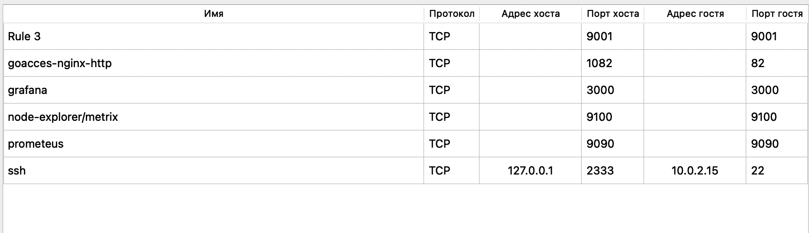

## `работа node_exporter`
### http://localhost:9100/metrics
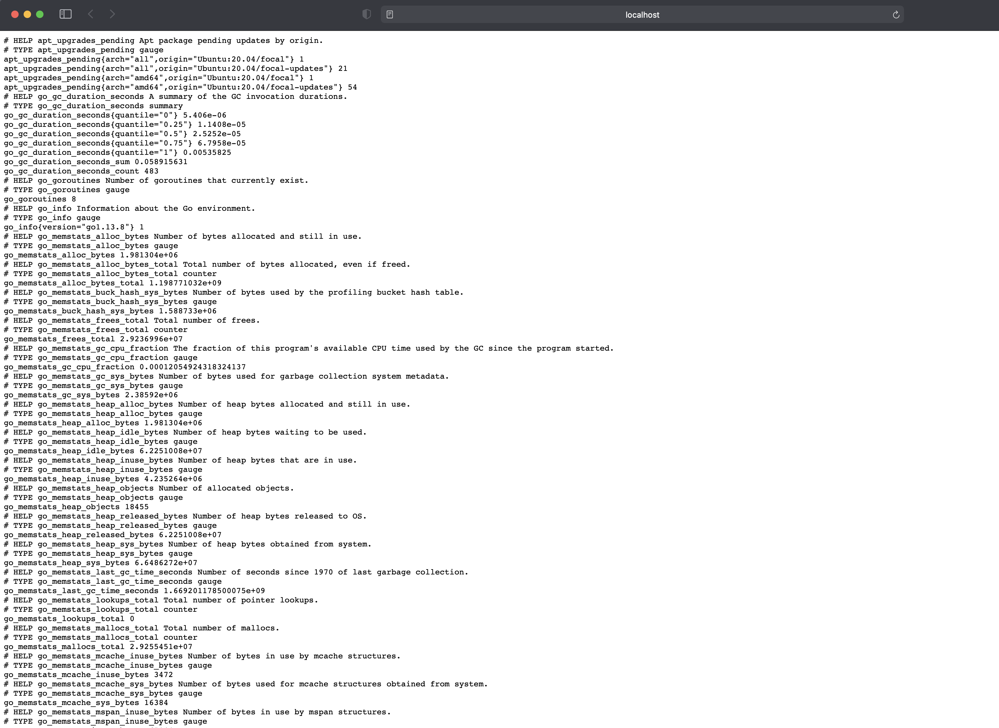

## `работа prometheus`
### http://localhost:9090/graph
### http://localhost:9090/targets
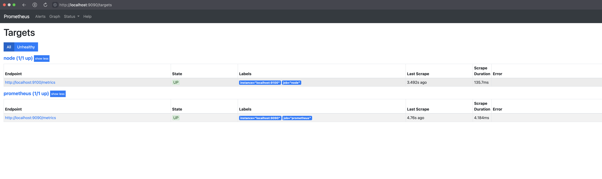

## `установка grafana`
#### 1 - сделать общую папку с локальной машиной (https://medium.com/macoclock/share-folder-between-macos-and-ubuntu-4ce84fb5c1ad)
 > - Запустите Virtualbox
 > - Нажмите на виртуальную машину Ubuntu > Настройки > Общие папки
 > - Нажмите кнопку `"добавить новую общую папку"` в правой части окна
 > - Путь к папке: нажмите стрелку раскрывающегося списка > другое... > выберите папку, которой вы хотите поделиться > открыть
 > - Имя папки: Имя папки будет автоматически обновлено, как только вы выберете путь к папке
 > - Установите флажок `"Автоматическое монтирование"` > OK
 > - Запустите виртуальную машину Ubuntu
 > - Создайте новую папку, в которой вы хотите получать общие файлы, или пропустите этот шаг, если вы хотите поделиться с существующей папкой.
 >> - `mkdir /home/student/mac_shared`
 >> - `cd /home/student`
 > - затем используйте следующее для монтирования общей папки
 >> -`sudo mount -t vboxsf shared_folder /home/student/mac_shared`
 > - Примечание: shared_folder  - это имя общей папки с Mac
 > - /home/student/mac_shared - это каталог папки в Ubuntu.
#### 2 - поместить файл графаны в общую папку
> #### `sudo apt install /home/student/mac_shared/grafana_9.2.3_amd64.deb` -> (путь редактировать)
> #### `sudo systemctl daemon-reload`
> #### `sudo systemctl start grafana-server`
> #### `sudo systemctl status grafana-server`
http://localhost:3000

### 
### `https://grafana.com/docs/grafana/latest/dashboards/build-dashboards/create-dashboard/`
#### `https://www.tigera.io/learn/guides/prometheus-monitoring/prometheus-metrics/` - примеры дашбордов
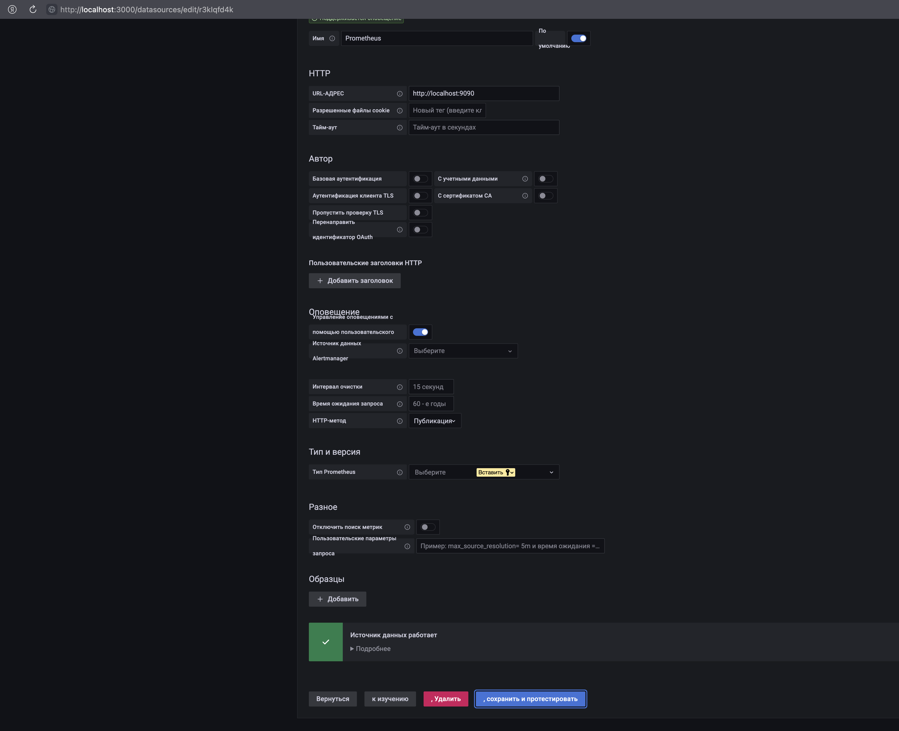
#### без нагрузки

#### с нагрузкой от скрипта из второго задания 
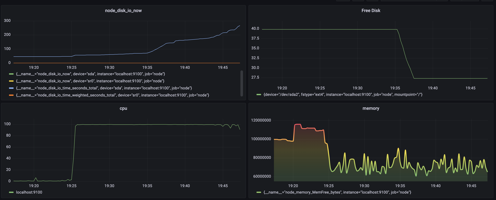
#### `stress -c 2 -i 1 -m 1 --vm-bytes 32M -t 10s`

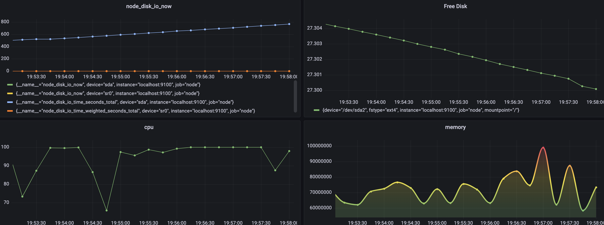

## Part 8. Готовый дашборд

Собственно, зачем составлять собственный дашборд, если, как говорится, "всё уже украдено до нас"?
Почему бы не взять готовый дашборд, на котором есть все нужные метрики?

**== Задание ==**

##### Установить готовый дашборд *Node Exporter Quickstart and Dashboard* с официального сайта **Grafana Labs**

##### Провести те же тесты, что и в [Части 7](#part-7-prometheus-и-grafana)

##### Запустить ещё одну виртуальную машину, находящуюся в одной сети с текущей
##### Запустить тест нагрузки сети с помощью утилиты **iperf3**

##### Посмотреть на нагрузку сетевого интерфейса

# Результат выполнения задания ⬇︎
1. Download the ready-made dashboard `Node Exporter Quickstart and Dashboard` from `Grafana Labs` official website. 
  > https://grafana.com/oss/prometheus/exporters/node-exporter/?tab=dashboards
  - 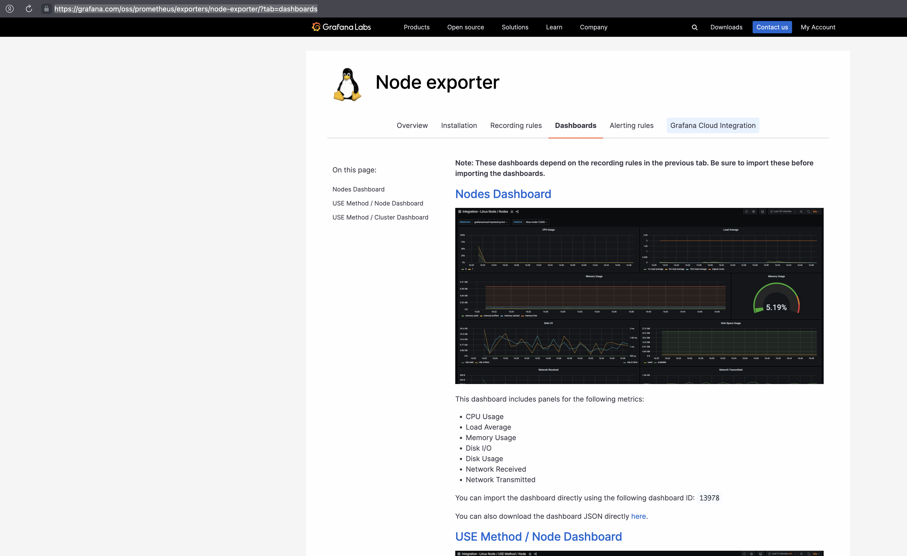

  - 

  - http://localhost:3000
  - скачиваем 
  - добавляем тут http://localhost:3000/dashboard/import 
  - пользуемся 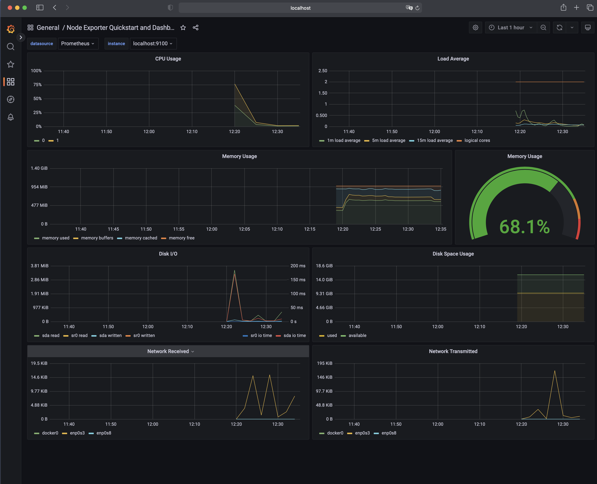
2. Запустить ещё одну виртуальную машину, находящуюся в одной сети с текущей 
3. Запустить тест нагрузки сети с помощью утилиты iperf3
    - sudo apt install iperf3
4. Посмотреть на нагрузку сетевого интерфейса
    - тест скорости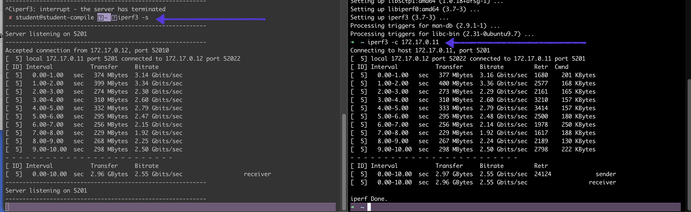
    - результат в графане 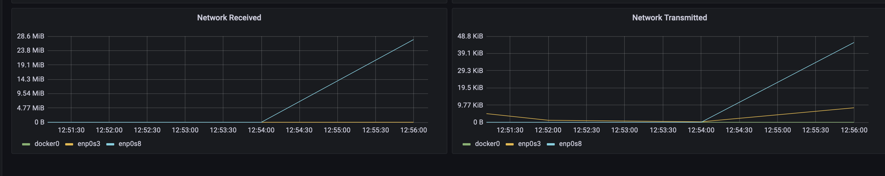

## Part 9. Дополнительно. Свой *node_exporter*

Анализировать систему с помощью специальных утилит полезно и удобно, но вам всегда хотелось понять, как же они работают.

**== Задание ==**

Написать bash-скрипт или программу на Си, которая собирает информацию по базовым метрикам системы (ЦПУ, оперативная память, жесткий диск (объем)).
Скрипт или программа должна формировать html страничку по формату **Prometheus**, которую будет отдавать **nginx**. \
Саму страничку обновлять можно как внутри bash-скрипта или программы (в цикле), так и при помощи утилиты cron, но не чаще, чем раз в 3 секунды.

# Результат выполнения задания ⬇︎
1. ✅ `Написать bash-скрипт или программу на Си, которая собирает информацию по базовым метрикам системы `
    - ЦПУ 
    - оперативная память 
    - жесткий диск (объем)
2. ✅ `Скрипт или программа должна формировать html страничку по формату Prometheus, которую будет отдавать nginx.`  
3. ✅`Саму страничку обновлять можно:`
    - ✅ внутри bash-скрипта или программы **в цикле**
    - при помощи утилиты **cron**
        - раз в 3 секунды.
##### (https://russianblogs.com/article/132581624/)
4. ✅`Поменять конфигурационный файл Prometheus, чтобы он собирал информацию с созданной вами странички.`
5. ✅`Провести те же тесты, что и в Части 7`
- без нагрузки 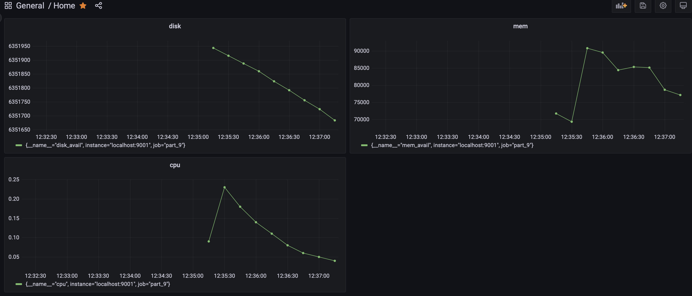
- с нагрузкой от скрипта из второго задания  
- `stress -c 2 -i 1 -m 1 --vm-bytes 32M -t 10s` 
