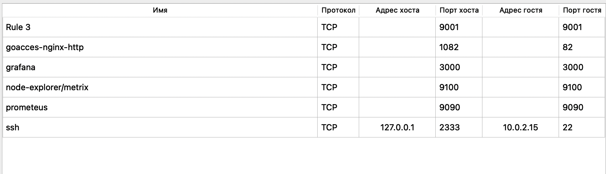
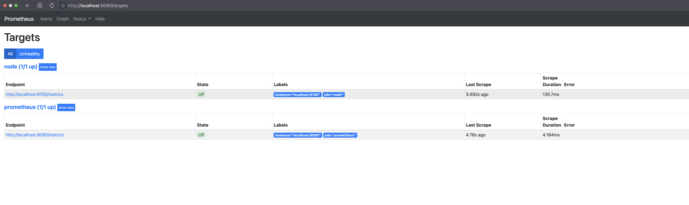
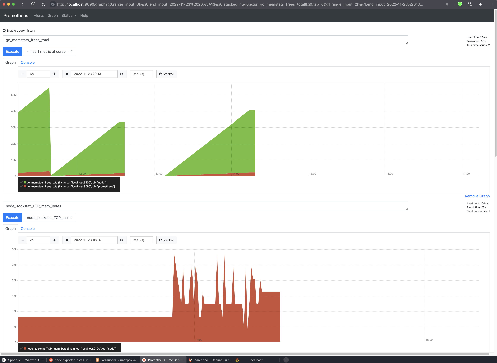
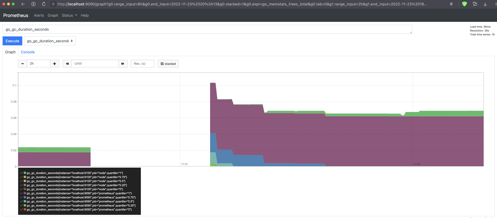
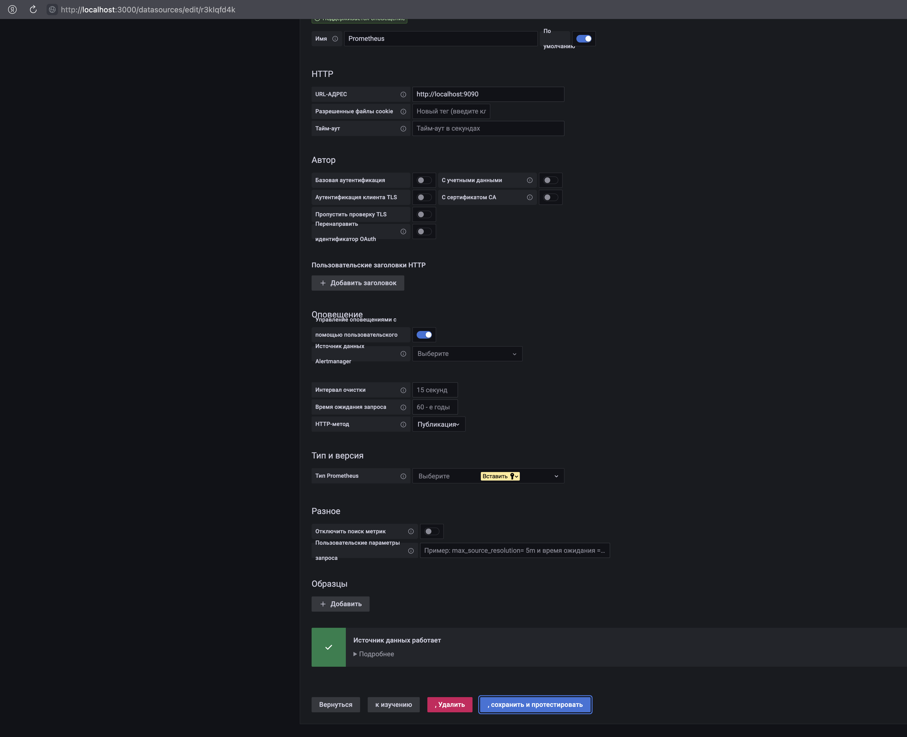
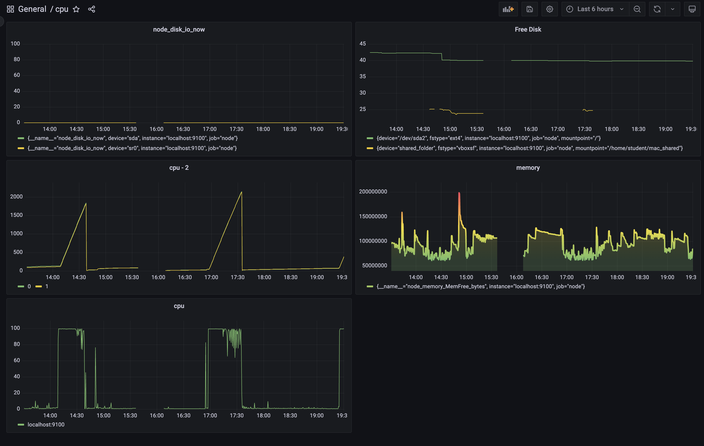
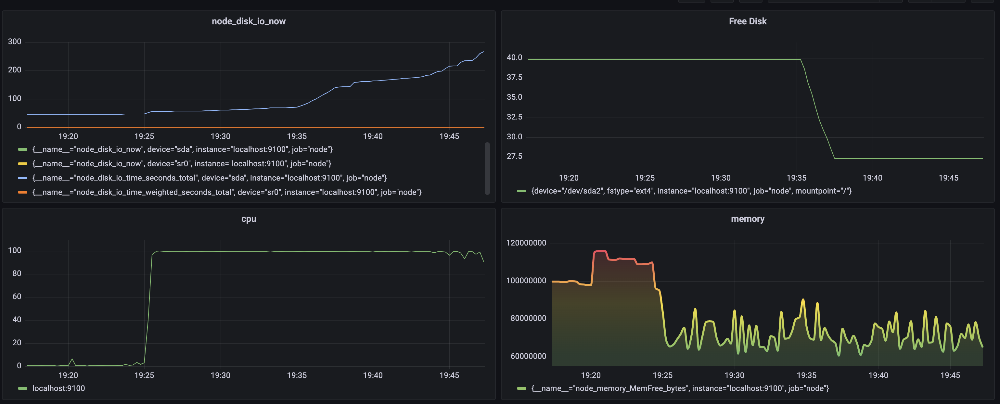
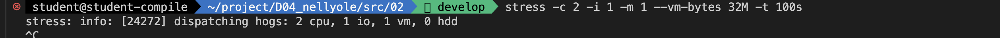
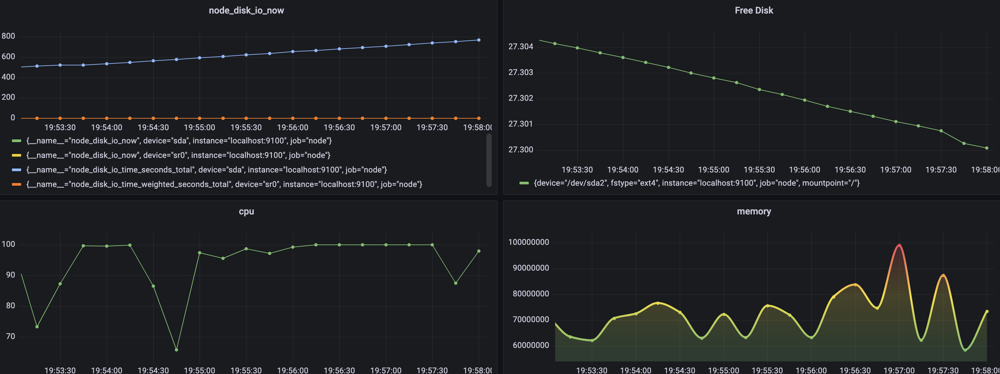

## `part_7`
#### порты 

## `работа node_exporter`
### http://localhost:9100/metrics

## `работа prometheus`
### http://localhost:9090/graph
### http://localhost:9090/targets

## `установка grafana`
#### 1 - сделать общую папку с локальной машиной (https://medium.com/macoclock/share-folder-between-macos-and-ubuntu-4ce84fb5c1ad)
 > - Запустите Virtualbox
 > - Нажмите на виртуальную машину Ubuntu > Настройки > Общие папки
 > - Нажмите кнопку `"добавить новую общую папку"` в правой части окна
 > - Путь к папке: нажмите стрелку раскрывающегося списка > другое... > выберите папку, которой вы хотите поделиться > открыть
 > - Имя папки: Имя папки будет автоматически обновлено, как только вы выберете путь к папке
 > - Установите флажок `"Автоматическое монтирование"` > OK
 > - Запустите виртуальную машину Ubuntu
 > - Создайте новую папку, в которой вы хотите получать общие файлы, или пропустите этот шаг, если вы хотите поделиться с существующей папкой.
 >> - `mkdir /home/student/mac_shared`
 >> - `cd /home/student`
 > - затем используйте следующее для монтирования общей папки
 >> -`sudo mount -t vboxsf shared_folder /home/student/mac_shared`
 > - Примечание: shared_folder  - это имя общей папки с Mac
 > - /home/student/mac_shared - это каталог папки в Ubuntu.
#### 2 - поместить файл графаны в общую папку
> #### `sudo apt install /home/student/mac_shared/grafana_9.2.3_amd64.deb` -> (путь редактировать)
> #### `sudo systemctl daemon-reload`
> #### `sudo systemctl start grafana-server`
> #### `sudo systemctl status grafana-server`
http://localhost:3000

### 
### `https://grafana.com/docs/grafana/latest/dashboards/build-dashboards/create-dashboard/`
#### `https://www.tigera.io/learn/guides/prometheus-monitoring/prometheus-metrics/` - примеры дашбордов

#### без нагрузки

#### с нагрузкой от скрипта из второго задания 

#### `stress -c 2 -i 1 -m 1 --vm-bytes 32M -t 10s`

