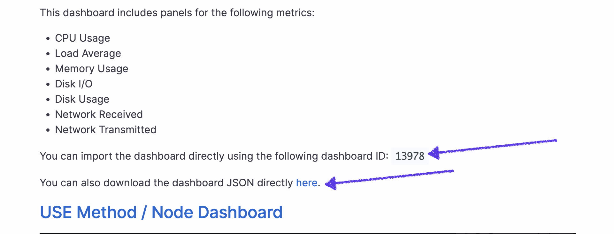

## `part_8`
1. Download the ready-made dashboard `Node Exporter Quickstart and Dashboard` from `Grafana Labs` official website. 
  > https://grafana.com/oss/prometheus/exporters/node-exporter/?tab=dashboards
  - 

  - 

  - http://localhost:3000
  - скачиваем 
  - добавляем тут http://localhost:3000/dashboard/import 
  - пользуемся 
2. Запустить ещё одну виртуальную машину, находящуюся в одной сети с текущей 
3. Запустить тест нагрузки сети с помощью утилиты iperf3
    - sudo apt install iperf3
4. Посмотреть на нагрузку сетевого интерфейса
    - тест скорости
    - результат в графане 