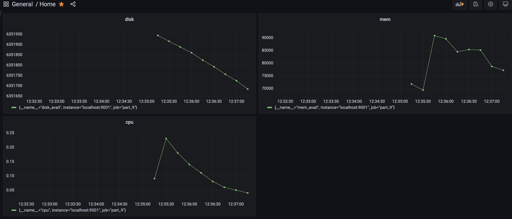
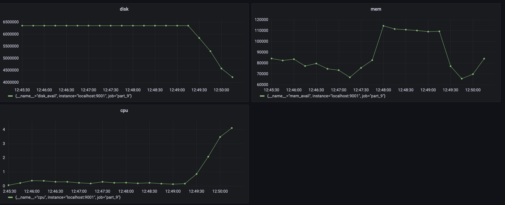
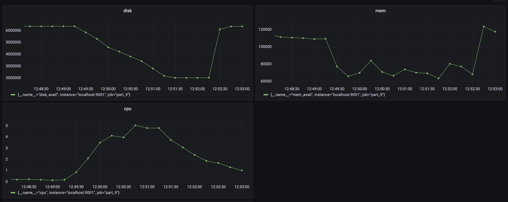
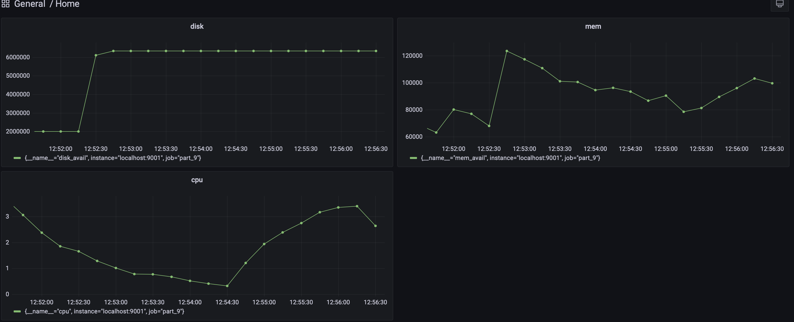

## `Part 9. Дополнительно. Свой node_exporter`
1. ✅ `Написать bash-скрипт или программу на Си, которая собирает информацию по базовым метрикам системы `
    - ЦПУ 
    - оперативная память 
    - жесткий диск (объем)
2. ✅ `Скрипт или программа должна формировать html страничку по формату Prometheus, которую будет отдавать nginx.`  
3. ✅`Саму страничку обновлять можно:`
    - ✅ внутри bash-скрипта или программы **в цикле**
    - при помощи утилиты **cron**
        - раз в 3 секунды.
##### (https://russianblogs.com/article/132581624/)
4. ✅`Поменять конфигурационный файл Prometheus, чтобы он собирал информацию с созданной вами странички.`
5. ✅`Провести те же тесты, что и в Части 7`
- без нагрузки 
- с нагрузкой от скрипта из второго задания  
- `stress -c 2 -i 1 -m 1 --vm-bytes 32M -t 10s` 
